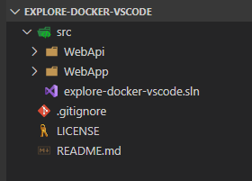

# explore-docker-vscode

This is a repo to explore Docker-related development with VS Code.

## Initial setup

- Create `src`, `src\WebApi`, and `src\WebApp` folders

  ```powershell
  md src
  md src/WebApi
  md src/WebApp
  ```

- Create default WebApi and WebApp .NET Core applications

  ```powershell
  cd src
  dotnet new webapi --name WebApi --output WebApi
  dotnet new webapp --name WebApp --output WebApp
  ```

- Create a solution file in the src folder and add both projects to the solution

  ```powershell
  dotnet new sln -n explore-docker-vscode
  dotnet sln explore-docker-vscode.sln add WebApi/WebApi.csproj
  dotnet sln explore-docker-vscode.sln add WebApp/WebApp.csproj
  ```

The project should look similar to this:



## Run both applications from VS Code

We'll have both applications running from VS Code so we can then update the `WebApp` application to consume the WebApi REST API to display a web page.

Configure the **`applicationUrl`** properties in `Properties/launchSettings.json` for both applications so they use different ports, as shown next:

For the **WebApi** application:

```json
{
  //...
    "WebApi": {
      "commandName": "Project",
      "launchBrowser": true,
      "launchUrl": "weatherforecast",
      "applicationUrl": "https://localhost:51443;http://localhost:51080",
      "environmentVariables": {
        "ASPNETCORE_ENVIRONMENT": "Development"
      }
    }
  }
}
```

For the **WebApp** application:

```json
{
  //...
    "WebApp": {
      "commandName": "Project",
      "launchBrowser": true,
      "applicationUrl": "https://localhost:50443;http://localhost:50080",
      "environmentVariables": {
        "ASPNETCORE_ENVIRONMENT": "Development"
      }
    }
  }
}
```

Install the [ms-dotnettools](https://marketplace.visualstudio.com/items?itemName=ms-dotnettools.csharp) VS Code extension to add support for C#. Yo can see more details in the [Working with C#](https://code.visualstudio.com/docs/languages/csharp) documentation page.

Then open the `src/WebApi/Program.cs` file, to get prompted to install the build and debug assets:


Respond with `Yes` and the choose the `WebApi` project at the prompt:


Configure the `tasks.json` file in the `.vscode` folder so they work on the solution folder and use the `.sln` file, that is, change the lines that show:

```json
"${workspaceFolder}/src/WebApi/WebApi.csproj",
```

To point to the solution folder:

```json
"${workspaceFolder}/src",
```

Configure the launch configurations to start both projects at the same time

Add the `uriFormat` configuration to the `serverReady` section of the API project:

```json
"serverReadyAction": {
    "action": "openExternally",
    "uriFormat": "%s/WeatherForecast",
    "pattern": "^\\s*Now listening on:\\s+(https?://\\S+)"
},
```

Copy the `.NET Core Launch (API)` configuration as `.NET Core Launch (Web)`, update the folder and .dll files to the `WebApp` project, and delete the `uriFormat` parameter, so you get to something like this:

```json
{
    "name": ".NET Core Launch (Web)",
    "type": "coreclr",
    "request": "launch",
    "preLaunchTask": "build",
    // If you have changed target frameworks, make sure to update the program path.
    "program": "${workspaceFolder}/src/WebApp/bin/Debug/netcoreapp3.1/WebApp.dll",
    "args": [],
    "cwd": "${workspaceFolder}/src/WebApp",
    "stopAtEntry": false,
    // Enable launching a web browser when ASP.NET Core starts. For more information: https://aka.ms/VSCode-CS-LaunchJson-WebBrowser
    "serverReadyAction": {
        "action": "openExternally",
        "pattern": "^\\s*Now listening on:\\s+(https?://\\S+)"
    },
    "env": {
        "ASPNETCORE_ENVIRONMENT": "Development"
    },
    "sourceFileMap": {
        "/Views": "${workspaceFolder}/Views"
    }
},
```

Add a compound configuration to start both `WebApi` and `WebApp` together:

```json
"compounds": [
    {
        "name": "ASP.NET Core API+Web",
        "configurations": [
            ".NET Core Launch (API)",
            ".NET Core Launch (Web)"
        ]
    }
]
```

You should now be able to run both applications by selecting the debugging side panel and choosing the just created "**ASP.NET Core API+Web**" configuration:


Both applications should now be running with the corresponding browser windows open, and both applications visible in the debugging panel:


**IMPORTANT**: keep in mind that now you have **two applications** to stop.

## Configure the WebApp application to consume the WebApi endpoint

We won't go into the change details because they are pretty standard and very basic and you can see them in the repo. Anyway these are changed files:

- **src/WebApp**
  - Startup.cs
  - WebApp.csproj
- **src/WebApp/Pages**
  - Index.cshtml
- **src/WebApp/Pages/WeatherForecast**
  - Index.cshtml
  - Index.cshtml.cs
  - WeatherForecast.cs
  - WeatherForecastApiClient.cs

## Additional resources

- **Integrate with External Tools via Tasks** \
  <https://code.visualstudio.com/docs/editor/tasks>

- **Debugging - Multi-target debugging** \
  <https://code.visualstudio.com/Docs/editor/debugging#_multitarget-debugging>

- **Configuring launch.json for C# debugging** \
  <https://github.com/OmniSharp/omnisharp-vscode/blob/master/debugger-launchjson.md#starting-a-web-browser>
