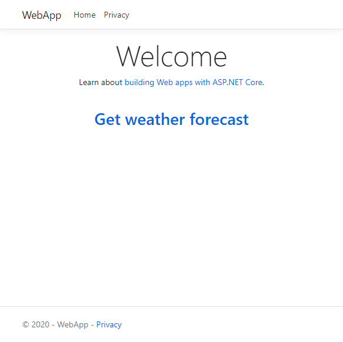
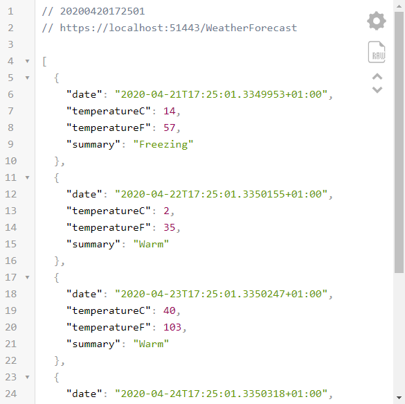
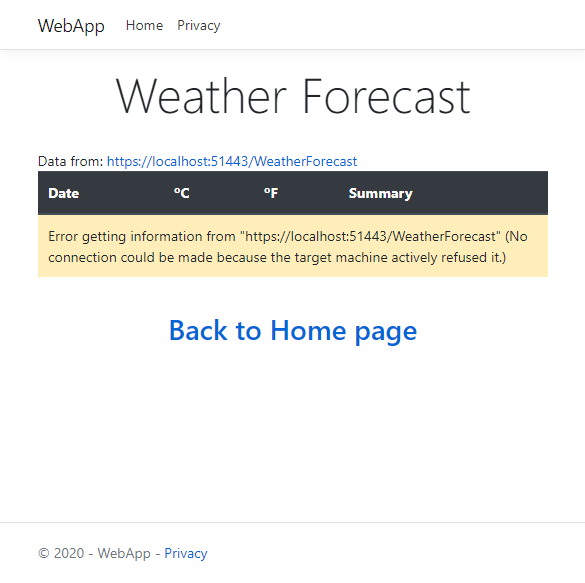
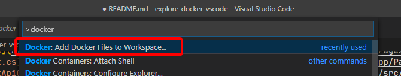
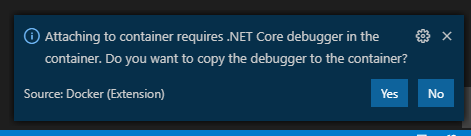
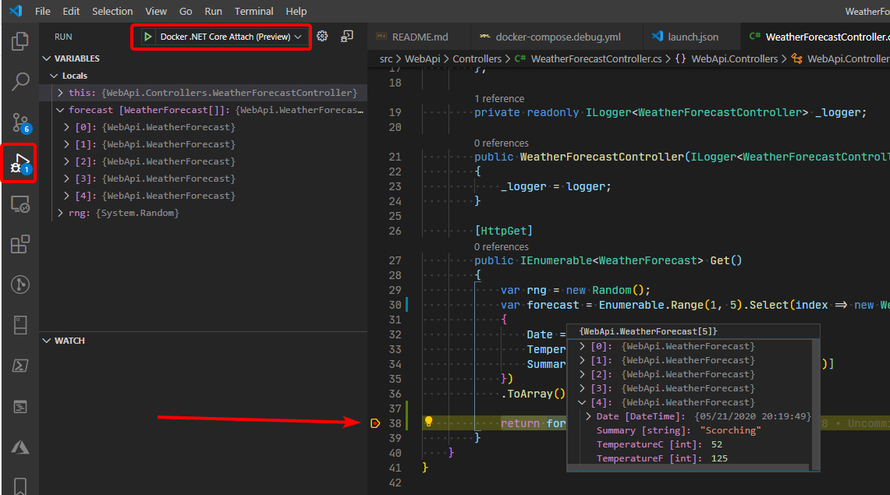

# explore-docker-vscode

In this repo we explore Docker-related development with VS Code.

- [Overview](#overview)
- [Details](#details)
  - [1 - Set up the environment](#1---set-up-the-environment)
  - [2 - Create the base applications](#2---create-the-base-applications)
  - [3 - Run both applications from VS Code](#3---run-both-applications-from-vs-code)
    - [Configure ports for WebApp and WebApi](#configure-ports-for-webapp-and-webapi)
    - [Install build and debug assets](#install-build-and-debug-assets)
    - [Update `tasks.json`](#update-tasksjson)
    - [Update `launch.json`](#update-launchjson)
  - [4 - Update the WebApp to consume the WebApi endpoint](#4---update-the-webapp-to-consume-the-webapi-endpoint)
  - [5 - Containerize the applications with docker-compose](#5---containerize-the-applications-with-docker-compose)
  - [6 - Debugging the multi-container application with docker-compose](#6---debugging-the-multi-container-application-with-docker-compose)
- [Additional resources](#additional-resources)

## Overview

In this repo we create a trivial application consisting of a Web Api back-end and a Web App front-end, to focus on the docker-related tasks when using VS Code.

We're going to:

1. Set up the environment.
2. Create the base Web + API applications.
3. Have both apps running at the same time from VS Code.
4. Update the WebApp to consume the WebApi endpoint.
5. Containerize the applications with docker-compose.
6. Debugging the containerized application.

## Details

### 1 - Set up the environment

- Install the [Microsoft C# extension](https://marketplace.visualstudio.com/items?itemName=ms-dotnettools.csharp).
- Install the [Microsoft Docker extension](https://marketplace.visualstudio.com/items?itemName=ms-azuretools.vscode-docker).
- Install [Docker Desktop](https://docs.docker.com/get-docker/).

See the [Working with C#](https://code.visualstudio.com/docs/languages/csharp) documentation page for details.

### 2 - Create the base applications

Create `src`, `src\WebApi`, and `src\WebApp` folders

```powershell
md src
md src/WebApi
md src/WebApp
```

Create `WebApi` and `WebApp` .NET Core applications using default dotnet templates.

```powershell
cd src
dotnet new webapi --name WebApi --output WebApi
dotnet new webapp --name WebApp --output WebApp
```

Create a solution file in the src folder and add both projects to the solution.

```powershell
dotnet new sln -n explore-docker-vscode
dotnet sln explore-docker-vscode.sln add WebApi/WebApi.csproj
dotnet sln explore-docker-vscode.sln add WebApp/WebApp.csproj
```

The project should look similar to this:


In this case the repo was created first in GitHub, that's why it has the `.gitignore`, `LICENSE` and `README.md` files.

### 3 - Run both applications from VS Code

#### Configure ports for WebApp and WebApi

Update the **`applicationUrl`** properties in `Properties/launchSettings.json` for both applications so they use different ports, as shown next:

For the **`WebApi`** application:

```json
{
  //...
    "WebApi": {
      "commandName": "Project",
      "launchBrowser": true,
      "launchUrl": "weatherforecast",
      "applicationUrl": "https://localhost:51443;http://localhost:51080",
      "environmentVariables": {
        "ASPNETCORE_ENVIRONMENT": "Development"
      }
    }
  }
}
```

For the **`WebApp`** application:

```json
{
  //...
    "WebApp": {
      "commandName": "Project",
      "launchBrowser": true,
      "applicationUrl": "https://localhost:50443;http://localhost:50080",
      "environmentVariables": {
        "ASPNETCORE_ENVIRONMENT": "Development"
      }
    }
  }
}
```

#### Install build and debug assets

Open the `src/WebApi/Program.cs` file, to get prompted to install the build and debug assets:


Respond with `Yes`. If you miss the prompt you can run the command:

`.NET: Generate Assets for Build and Debug`:


Then choose the `WebApi` project at the prompt, to create the initial `tasks.json` and `launch.json` files:


#### Update `tasks.json`

Configure the `tasks.json` file in the `.vscode` folder so they work on the solution folder, that is, change the lines that show:

```json
"${workspaceFolder}/src/WebApi/WebApi.csproj",
```

To point to the solution folder:

```json
"${workspaceFolder}/src",
```

The above change will make the commands work on the solution, instead of just one project.

#### Update `launch.json`

We'll now update the `launch.json` file to start both projects at the same time.

Add the `uriFormat` configuration to the `serverReady` section of the API project, to set the startup page for the `WebApi`:

```json
"serverReadyAction": {
    "action": "openExternally",
    "uriFormat": "%s/WeatherForecast",
    "pattern": "^\\s*Now listening on:\\s+(https?://\\S+)"
},
```

Copy the `.NET Core Launch (API)` configuration as `.NET Core Launch (Web)`, update the folder and .dll files to the `WebApp` project, and delete the `uriFormat` parameter, so you get to something like this:

```json
{
    "name": ".NET Core Launch (Web)",
    "type": "coreclr",
    "request": "launch",
    "preLaunchTask": "build",
    // If you have changed target frameworks, make sure to update the program path.
    "program": "${workspaceFolder}/src/WebApp/bin/Debug/netcoreapp3.1/WebApp.dll",
    "args": [],
    "cwd": "${workspaceFolder}/src/WebApp",
    "stopAtEntry": false,
    // Enable launching a web browser when ASP.NET Core starts. For more information: https://aka.ms/VSCode-CS-LaunchJson-WebBrowser
    "serverReadyAction": {
        "action": "openExternally",
        "pattern": "^\\s*Now listening on:\\s+(https?://\\S+)"
    },
    "env": {
        "ASPNETCORE_ENVIRONMENT": "Development"
    },
    "sourceFileMap": {
        "/Views": "${workspaceFolder}/Views"
    }
},
```

Add a `compounds` object to start both `WebApi` and `WebApp` together, right after the `configurations` object. Actually, the VS Code extension should suggest the "compounds" object once you begin to write it:

```json
"compounds": [
    {
        "name": "ASP.NET Core API+Web",
        "configurations": [
            ".NET Core Launch (API)",
            ".NET Core Launch (Web)"
        ]
    }
]
```

At this point you should be able to run both applications by selecting the debugging side panel and choosing the just created "**ASP.NET Core API+Web**" configuration:


Both applications should be running with the corresponding browser windows open:

- **WebApp**: <https://localhost:50433/>
- **WebApi**: <https://localhost:51443/WeatherForecast>

Also, both applications should be visible in the debugging panel:


**IMPORTANT**: keep in mind that now you have **two applications** to stop.

### 4 - Update the WebApp to consume the WebApi endpoint

We won't go into the change details because they are pretty standard and very basic, and you can see them in the repo.

Anyway these are changed files, with links to the source code:

- **src/WebApp**
  - [Startup.cs](https://github.com/mvelosop/explore-docker-vscode/blob/master/src/WebApp/Startup.cs)
  - [WebApp.csproj](https://github.com/mvelosop/explore-docker-vscode/blob/master/src/WebApp/WebApp.csproj)
- **src/WebApp/Pages**
  - [Index.cshtml](https://github.com/mvelosop/explore-docker-vscode/blob/master/src/WebApp/Pages/Index.cshtml)
- **src/WebApp/Pages/WeatherForecast**
  - [Index.cshtml](https://github.com/mvelosop/explore-docker-vscode/blob/master/src/WebApp/Pages/WeatherForecast/Index.cshtml)
  - [Index.cshtml.cs](https://github.com/mvelosop/explore-docker-vscode/blob/master/src/WebApp/Pages/WeatherForecast/Index.cshtml.cs)
  - [WeatherForecast.cs](https://github.com/mvelosop/explore-docker-vscode/blob/master/src/WebApp/Pages/WeatherForecast/WeatherForecast.cs)
  - [WeatherForecastApiClient.cs](https://github.com/mvelosop/explore-docker-vscode/blob/master/src/WebApp/Pages/WeatherForecast/WeatherForecastApiClient.cs)

You should now be able to run both applications and get views like these:

- **Web App Home page** - <https://localhost:50433/>

  

- **Web App Weather Forecast** - <https://localhost:50433/WeatherForecast>

  

- **Web API Weather Forecast** - <https://localhost:51443/WeatherForecast>

  

- **Web App Weather Forecast with Web API shut down**

  

### 5 - Containerize the applications with docker-compose

Add the docker files to the workspace, by running the command

`Docker: Add Docker Files to Workspace`



You'll have to enter/select the following parameters:

| Parameter                     | Value                        |
|-------------------------------|------------------------------|
| Application Platform          | .NET: ASP.NET Core           |
| Operating System              | Linux                        |
| Include Docker Compose files? | Yes                          |
| Ports lo expose               | 80, 443                      |
| Project                       | src/WebApi/**WebApi**.csproj |

This process adds/updates a few files:

- Adds the **Dockerfile** file to the **WebApi** project
- Adds the **.dockerignore** file.
- Adds the **docker-compose.debug.yml** file.
- Adds the **docker-compose.yml** file
- Updates **tasks.json** to add the `docker-build` and `docker-run` tasks for `debug` and `release` configurations.
- Updates **launch.json** to add a `Docker .NET Core launch` setting.

The updates to **tasks.json** and **launch.json** are only useful for running a single container application, but not so in a multi-container application.

Now let's repeat the process for the **WebApp** project and answer **NO** when the process asks to overwrite the **tasks.json**, **launch.json** and **.dockerignore** files.

The process also generates the **docker-compose1.yml** and **docker-compose.debug1.yml** files for the **WepApp** project, that you'll have to merge manually into the **docker-compose.yml** and **docker-compose.debug.yml** files generated previously.

You also have to add a few configuration parameters to:

- Expose WebApi on port 51080
- Expose WebApp on port 50080
- Configure WebApp with the WebApi's internal base address to access the endpoint.

So the docker-compose.yml file finally gets to this:

```yml
version: '3.4'

services:
  webapi:
    image: webapi
    build:
      context: .
      dockerfile: src/WebApi/Dockerfile
    ports:
      - 51080:80
    environment:
      - ASPNETCORE_ENVIRONMENT=Development
      - ASPNETCORE_URLS=http://+:80

  webapp:
    image: webapp
    build:
      context: .
      dockerfile: src/WebApp/Dockerfile
    ports:
      - 50080:80
    environment:
      - ASPNETCORE_ENVIRONMENT=Development
      - ASPNETCORE_URLS=http://+:80
      - WebApiBaseAddress=http://webapi
```

### 6 - Debugging the multi-container application with docker-compose

To debug the application running in the containers, we have to:

- Configure the `docker-compose.debug.yml` file the same parameters we just added to `docker-compose.yml`.
- Add a launch configuration to attach the debugger to a container.
- Run docker-compose with the `docker-compose.debug.yml` file.
- Install the .NET Core debugger in the development machine (this occurs the first time you debug).

So let's go with the details.

The `docker-compose.debug.yml` file has to be as shown next, notice the volume mounted from the file system, so the containers can use the debugger from the development machine.

```yml
version: '3.4'

services:
  webapi:
    image: webapi
    build:
      context: .
      dockerfile: src/WebApi/Dockerfile
    ports:
      - 51080:80
    environment:
      - ASPNETCORE_ENVIRONMENT=Development
      - ASPNETCORE_URLS=http://+:80
    volumes:
      - ~/.vsdbg:/remote_debugger:rw

  webapp:
    image: webapp
    build:
      context: .
      dockerfile: src/WebApp/Dockerfile
    ports:
      - 50080:80
    environment:
      - ASPNETCORE_ENVIRONMENT=Development
      - ASPNETCORE_URLS=http://+:80
      - WebApiBaseAddress=http://webapi
    volumes:
      - ~/.vsdbg:/remote_debugger:rw
```

To add the launch configuration, go to the **Debug** tab and select the "**Add Configuration...**" option on the **Configuration** dropdown, and select the "**Docker: .NET Core Attach (Preview)**" template. This should add a configuration like the following:

```json
{
    "name": "Docker .NET Core Attach (Preview)",
    "type": "docker",
    "request": "attach",
    "platform": "netCore",
    "sourceFileMap": {
        "/src": "${workspaceFolder}"
    }
},
```

Now you have to run docker compose with the `.debug` file, and you can do that by right-clicking on the `docker-compose.debug.yml` file from the VS Code explorer view or from the command line:

```powershell
docker-compose -f .\docker-compose.debug.yml up -d
```

When all containers are up and running (it might take a little while), start the debugger with the newly added configuration (**Docker .NET Core Attach (Preview)**) and select the running container that you want to debug.

The first time you start the debugger you'll receive a message prompting you to install the debugger, like this:



Click **Yes** to download the debugger to the `~\.vsdbg` folder.

When the download finishes (it can take a little while) you can start debugging as usual, setting breakpoints and inspecting variables in the source code, as shown in the next image.



Hope this helps 😊

## Additional resources

- **Integrate with External Tools via Tasks** \
  <https://code.visualstudio.com/docs/editor/tasks>

- **Debugging - Multi-target debugging** \
  <https://code.visualstudio.com/Docs/editor/debugging#_multitarget-debugging>

- **Configuring launch.json for C# debugging** \
  <https://github.com/OmniSharp/omnisharp-vscode/blob/master/debugger-launchjson.md#starting-a-web-browser>

- **Customize the Docker extension - Docker** \
  <https://code.visualstudio.com/docs/containers/reference#_build-task-reference>

- **Use Docker Compose - Visual Studio Code** \
  <https://code.visualstudio.com/docs/containers/docker-compose>
